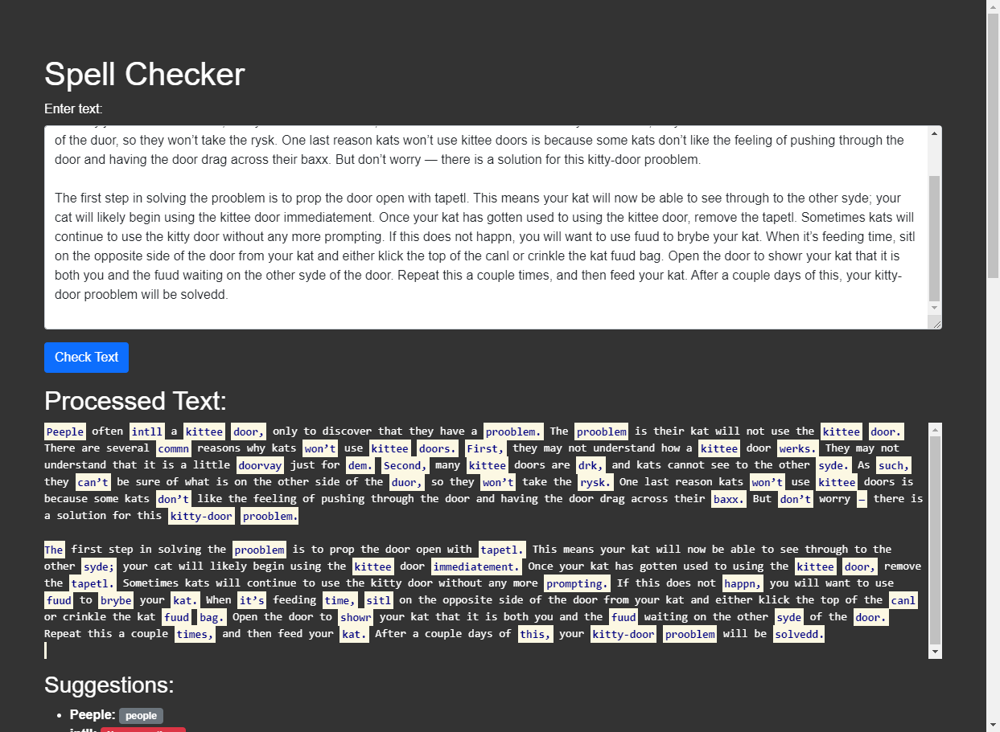

# Spell Checker Web Server



A simple web server for checking spelling and providing suggestions for misspelled words.

## Getting Started

These instructions will get your copy of the project up and running on your local machine for development and testing purposes.

### Prerequisites

You need Docker installed on your computer to run this application in a containerized environment.

### Installing

Clone the repository to your local machine:

```bash
git clone https://yourrepository.com/spellchecker.git
cd spellchecker
```

### Building the Docker Image

To build the Docker image, run:
```bash
make build
```

### Running the Docker Container
```bash
make run
```

This command will start the Docker container where the spell checker server runs. The server will be available at http://localhost:8080.

### Stopping the Server

To stop the Docker container, you can use:

<kbd>Ctrl</kbd> + <kbd>C</kbd>

### Cleaning Up

To remove the built Docker image, run:

```bash
make clean
```

## Running the tests

To run the tests, use the following command:

```bash
make test
```


## Using the Spell Checker

After starting the server, navigate to http://localhost:8080 in your web browser. You will see a form to submit text for spell checking. Results will show on the same page along with suggestions for any misspelled words.

## Contributing

You need to fork the repository and submit a pull request to contribute to this project. Install Git, Go, and Docker on your computer to build and run the project.


## License

This project is licensed under the MIT License - see the [LICENSE.md](LICENSE.md) file for details.
